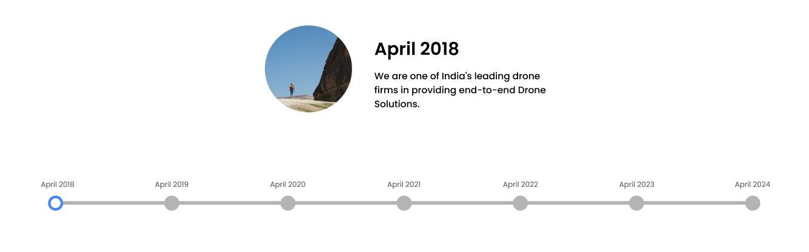

# IG Drones Timeline

Completed the task of cloning the following timeline:

## Features

- **Dynamic Content Update:** The month, description, and image change as users interact with the slider or buttons.
- **Smooth Animations:** smooth transitions for text and images as they update.
- **Responsive Design:** The layout adapts to different screen sizes, ensuring a consistent experience across devices.
- **Interactive Slider:** A custom-styled slider control allows users to easily navigate through different timeline points.
- **Navigation Buttons:** Left and right buttons allow users to scroll through the timeline in addition to the slider.

## How to Use

1. **Slider Control:** Drag the slider to navigate between different timeline entries (e.g., April 2018 to April 2024). The displayed month, description, and image will update accordingly.
2. **Navigation Buttons:** Use the left (`<`) and right (`>`) buttons to scroll through the timeline.

## live link

check it out at <https://soumya-ranjanswain.github.io/igdrones-task-timeline/>
